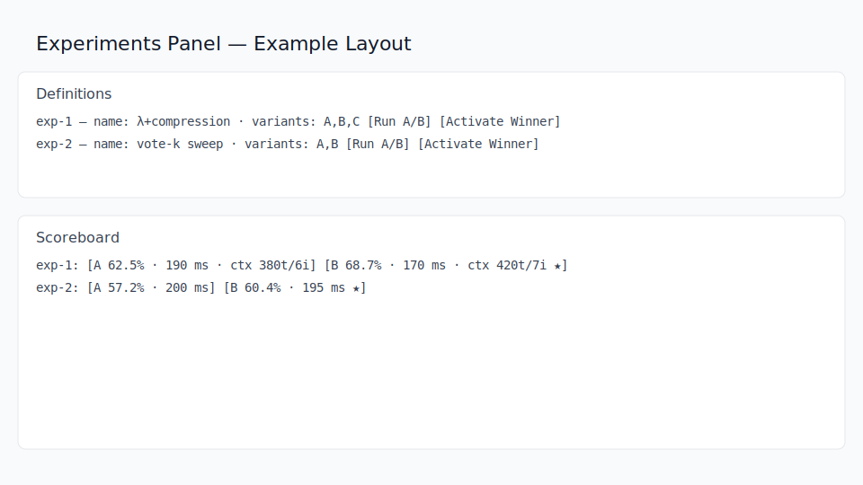

# Debug UI Overview

Updated: 2025-09-15
Type: How‑to

The Debug UI (served by the Tauri Launcher or via `/admin`) is a lightweight control panel for ARW. It exposes a live event stream, useful admin actions, and compact insight panels. This page highlights two high‑leverage areas you’ll likely use often: Context Assembly and Experiments.

## Trust (RPU)

- A dedicated Trust (RPU) panel shows a redacted trust store summary — issuer ids and algorithms — along with the last reload time.
- Buttons:
  - Refresh → `GET /admin/rpu/trust`
  - Reload → `POST /admin/rpu/reload` (publishes `rpu.trust.changed`)
- The Events viewer includes an “RPU only” preset and refreshes the panel automatically on `rpu.trust.changed`.

## Context Assembly

- Button: Assemble → calls `GET /admin/context/assemble?q=...&k=...`.
- Returns a structured payload with `beliefs`, `recent` (intents/actions/files), and `policy/model`.
- Preview: A rendered `context_preview` shows the formatted evidence block that downstream recipes will see.
- KPIs: a small row displays the effective retrieval K and MMR λ (diversity), compression aggressiveness, and a tokens/items summary for the evidence.

### Overrides (non‑persistent)

Toggle “overrides” to apply per‑call settings without changing hints:

- `context_format` (bullets|jsonl|inline|custom)
- `include_provenance`
- `context_item_template` (for format=custom)
- `context_header`, `context_footer`, `joiner`
- `context_budget_tokens`, `context_item_budget_tokens`

These map to query parameters accepted by `/admin/context/assemble`. The returned `aux.context` includes packing metrics: tokens/items before→after, budget, and per‑item cap.

## Experiments (A/B)

The UI exposes two complementary areas:

1) Goldens / Experiments box: quick actions to seed goldens, run A/B, and see summary solve/latency.
2) Experiments (Live) panel: definitions list, a live scoreboard, and one‑click actions.

### Definitions

- Refresh defs → loads current experiment definitions (`/admin/experiments/list`).
- Each row shows the id, name, and variants.
- Shortcuts per experiment:
  - Run A/B → calls `/admin/experiments/run` with all variants for that experiment.
  - Activate Winner → calls `/admin/experiments/activate` with the last winner (persisted) or the best live result.

### Scoreboard

- Live variant badges show: solve rate, latency, and context KPIs `ctx {tokens}t/{items}i`.
- The panel auto‑updates from SSE (`experiment.result` and `experiment.winner`).
- “Refresh defs” seeds the board from persisted data (`/admin/experiments/scoreboard` and `/admin/experiments/winners`).

### Event Payloads

`experiment.result` includes:

- `passed`, `failed`, `total`, `avg_latency_ms`
- `avg_ctx_tokens`, `avg_ctx_items`
- `knobs` for traceability (retrieval, budgets, formatting)

`experiment.winner` includes `{exp_id, proj, winner}`; winners are persisted.

## Tips

- Use the Assemble overrides to trial formatting/budget changes before baking them into hints or variants.
- Watch the KPIs while iterating: the best solve rate with a much larger context may not be worth the cost unless justified.
- The A/B runner executes in batch lanes; keep interactive work fast by scheduling heavy runs off‑peak.
- Screenshot (placeholder):

- Screenshot (placeholder):

- Screenshot (placeholder):

## How to Capture Screenshots

You can replace the placeholder images with real screenshots of your environment:

1) From the browser (served at `/admin`)
- Resize the window to a reasonable width (e.g., 1280px) for readability.
- Capture OS screenshot: macOS (Shift+Cmd+4), Windows (Win+Shift+S), Linux (PrtSc / gnome‑screenshot / flameshot).
- Save to `Agent_Hub/docs/images/` using the same filenames:
  - `context_assemble.svg` (or `.png`)
  - `experiments_panel.svg` (or `.png`)
  - `experiments_scoreboard.svg` (or `.png`)

2) From the Tauri Launcher window
- Open the Debug UI from the tray.
- Use the OS screenshot tool to capture just the relevant panel.

3) Developer Tools (optional precision)
- In the browser, open DevTools → Run a full‑page capture extension or use the device toolbar to emulate widths.
- For retina clarity: double the width and scale down when embedding.

4) File format & linking
- Prefer `.png` for simplicity; `.svg` is acceptable for vector annotations.
- Keep the same filenames as above so the docs links resolve without editing.
- Commit the images and rebuild docs.
