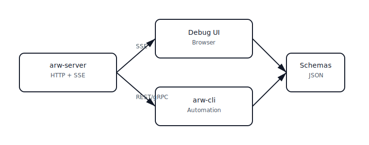
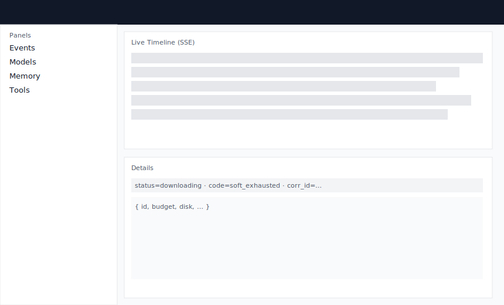

# Screenshots

Microsummary: A quick visual tour — architecture at a glance and the Debug UI. Each image includes alt text for accessibility. Stable anchors.

Architecture overview

Debug UI (mock)

Notes
- The Debug UI appears at `/debug` when `ARW_DEBUG=1` is set.
- Live events stream from `/admin/events` (SSE). Use `?prefix=Models.&replay=10` to filter and replay.
- Want to contribute real screenshots? Capture at 1x scale and add to `docs/images/` (PNG or SVG). Keep filenames stable and update this page.

