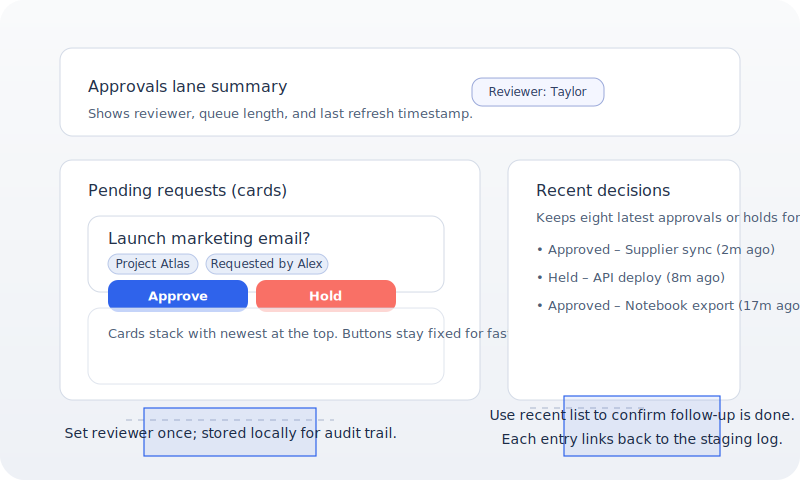

# Approvals Lane Guide

Updated: 2025-10-16
Type: Operator walkthrough

This guide shows how to clear Gate G2 (“Calm approvals”) during trial rehearsals. It pairs the launcher Trial Control Center UI with the runbook so operators can keep approvals moving without leaving the hub.

## 1. Set the reviewer badge

- Open **Launcher → Trial Control**.
- Click **Set reviewer** the first time you open the lane. The name is cached locally and stamped on approvals audit entries.
- Change the reviewer whenever responsibility shifts; we call this out in the daily stand-up.

## 2. Work the queue

- The **Approvals lane** lists pending requests with project, requester, and captured evidence.
- Use **Approve** to queue the action immediately. **Hold** asks for a reason, which is recorded in the staging log.
- The list refreshes itself every ~25 seconds while the Trial Control window is visible; the summary line shows “updated …” with the server timestamp so you know how fresh the queue is.
- Aim to keep the queue under three items; the tile turns amber/red when the backlog grows.
- If you see missing context, click **Open debug queue** to jump into the detailed staging view (`/admin/debug#/approvals`).

## 3. Track recent decisions

- The **Recent decisions** list (right column) shows the latest eight approvals or holds.
- Use it to double-check that follow-up happened after the decision (for example, copy/pasting an email draft).
- Entries include who approved/held the action and link back to the staging record inside the launcher.

## 4. Verify feedback deltas

- Open the **Feedback** tile in the Trial Control Center or run `arw-cli feedback state --json | jq '.delta_log[0]'` to review the most recent `feedback.delta` entry.
- Each delta summarises what changed between heuristic runs (added / removed / changed suggestions). Call out surprises in the shared log before we consider enabling auto-apply.
- Need to watch live? Tail `arw-cli events tail --kind feedback.delta` so the approvals team sees shadow suggestions as they update.

## 5. Connections drawer (who is online?)

- Press **Connections** in the Trial Control header or hit `C` when the page is focused.
- The drawer lists remote nodes, health, and capability hints so you know which teammate or helper is connected.
- A background refresh runs every ~35 seconds; the summary line shows the last server timestamp. Use **Refresh** if you need an immediate update (for example, right after inviting someone).
- Close with `Esc` or the **Close** button—the launcher restores the previous focus so keyboard flow stays smooth.

## 6. Troubleshooting signals

| Signal | What it means | Operator move |
| --- | --- | --- |
| “Authorize to view approvals queue” | Admin token missing or expired | Re-enter token in Launcher → Connections → Edit connection. |
| Buttons greyed out with spinner | Decision call in flight | Wait a few seconds; a toast appears on success/failure. |
| Tile stuck on “Approvals queue unavailable” | `/state/staging/actions` errored | Check server logs (`just logs-tail`) and fall back to `/admin/debug` if needed. |
| Recent decisions empty | Nobody has approved/held recently | Mention in stand-up; verify helpers are staging actions. |

## 7. Daily rhythm checklist

- ☐ Before rehearsal: reviewer badge set, queue empty, connections drawer lists only the two operators.
- ☐ Mid-session: queue ≤ 3, oldest approval < 15 minutes, annotate incidents in the shared log.
- ☐ End of day: queue clear, decisions reviewed, daily log updated with any holds and follow-ups.

### Cross references

- [Trial runbook](../trial_runbook.md)
- [Trial readiness gates](../trial_readiness.md)
- [Autonomy rollback playbook](autonomy_rollback_playbook.md)
